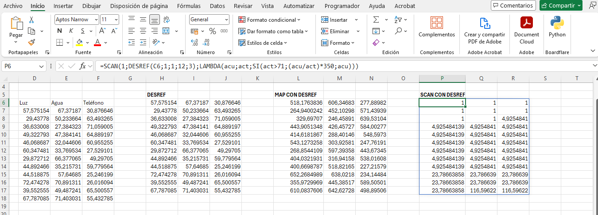
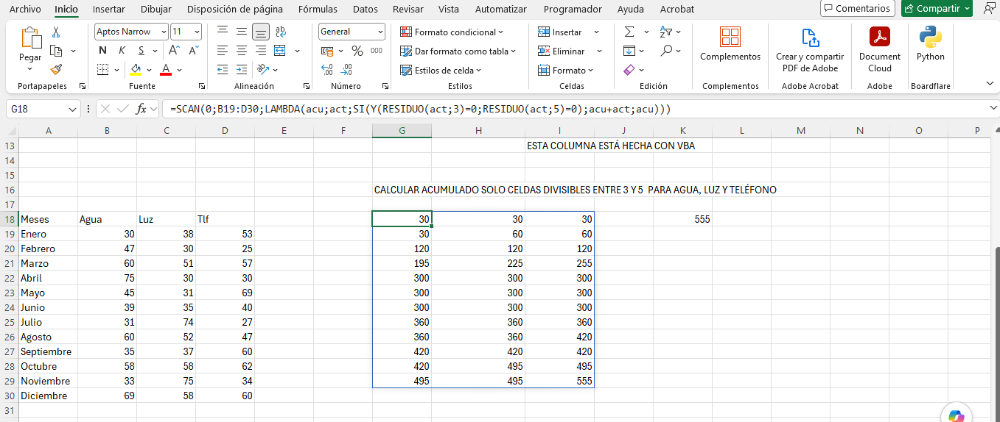
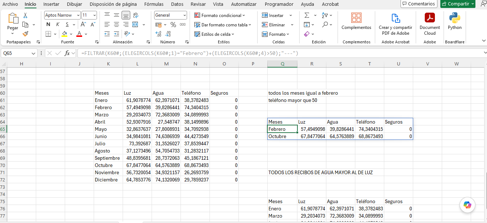

# 📊 Cuaderno de Excel Avanzado


*Recopilación técnica, modelos analíticos, fórmulas complejas y automatizaciones VBA para el dominio profesional de Microsoft Excel.*

---

## 📸 Vista Previa del Cuaderno de Excel

A continuación se muestran algunas capturas de pantalla con los ejercicios, funciones dinámicas y herramientas analíticas del proyecto:

### 1. SCAN Y DESREF


### 2. SCAN Y LAMBDA


### 3. FILTRAR Y ELEGIRCOLS


---

## 🔗 Acceso / Demo

Puedes acceder al repositorio directamente en GitHub para explorar los libros de trabajo, scripts y plantillas:

- **Repositorio oficial:** [github.com/migueljerico/Cuaderno_Excel_Avanzado](https://github.com/migueljerico/Cuaderno_Excel_Avanzado)
- **Descargar última versión (2026):** [ZIP del Proyecto](https://github.com/migueljerico/Cuaderno_Excel_Avanzado/archive/refs/heads/main.zip)

---

## 📋 Descripción

**Cuaderno_Excel_Avanzado** es un recurso estructurado orientando a profesionales, analistas de datos y desarrolladores de hojas de cálculo que buscan llevar sus habilidades de Microsoft Excel al siguiente nivel. Este proyecto recopila casos de uso reales, estructuras de datos optimizadas y guías paso a paso para dominar las capacidades analíticas de la herramienta.

El proyecto resuelve la problemática habitual del manejo ineficiente de grandes volúmenes de datos en hojas de cálculo, proporcionando patrones de diseño de modelos financieros, automatización de tareas repetitivas mediante macros VBA y técnicas avanzadas de transformación de datos mediante Power Query y Power Pivot.

Diseñado con un enfoque práctico y corporativo, el cuaderno abarca desde la formulación matricial dinámica hasta la creación de cuadros de mando (dashboards) ejecutivos e interactivos, adecuados para el entorno empresarial actual en 2026.

---

## ✨ Funcionalidades

| Funcionalidad | Descripción |
| :--- | :--- |
| **Formulación Avanzada y Dinámica** | Implementación de `BUSCARX` (`XLOOKUP`), `INDICE/COINCIDIR`, y matrices dinámicas (`FILTRAR`, `UNICOS`, `ORDENAR`, `ELEGIRCOLS`). |
| **Automatización con VBA / Macros** | Módulos de código para automatizar generación de reportes, envío masivo de correos y validación de datos. |
| **Modelado de Datos y DAX** | Creación de esquemas en estrella mediante Power Pivot e implementación de medidas calculadas con lenguaje DAX. |
| **Transformación ETL (Power Query)** | Limpieza, unificación y estructuración automatizada de fuentes de datos heterogéneas (CSV, SQL, Web, JSON). |
| **Dashboards e Indicadores (KPIs)** | Diseños de tableros ejecutivos con segmentadores de datos, gráficos dinámicos y controles de formulario. |
| **Auditoría y Optimización** | Buenas prácticas para reducir el tamaño de archivos, optimizar tiempos de cálculo y rastrear dependencias complejas. |

---

## ⚙️ Instalación

Para utilizar los cuadernos de trabajo y ejecutar los scripts de automatización en tu equipo local, sigue estos pasos:

1. **Clonar el repositorio:**
   ```bash
   git clone https://github.com/migueljerico/Cuaderno_Excel_Avanzado.git
   cd Cuaderno_Excel_Avanzado
   ```

2. **Requisitos previos del sistema:**
   - Microsoft Excel 365, Office 2021 o superior (edición 2026 recomendada).
   - Habilitar la pestaña **Programador / Desarrollador** en Excel:
     - Ir a `Archivo` > `Opciones` > `Personalizar cinta de opciones` > Marcar **Programador**.

3. **Configuración de Macros y Seguridad:**
   - En Excel, dirígete a `Archivo` > `Opciones` > `Centro de confianza` > `Configuración del Centro de confianza`.
   - En **Configuración de macros**, selecciona *Habilitar macros VBA* (o habilitar con notificación) para permitir la ejecución de las automatizaciones incluidas.

---

## 🚀 Uso

### Ejemplo: Consulta de Matriz Dinámica para Reportes Filtro

Uso de fórmulas dinámicas en Excel para la extracción en tiempo real de registros sin macros:

```excel
=ORDENAR(FILTRAR(TablaVentas[Cliente]:TablaVentas[Monto]; (TablaVentas[Region]="LATAM") * (TablaVentas[Monto]>5000); "Sin Resultados"); 2; -1)
```

---

## 📁 Estructura del proyecto

```text
Cuaderno_Excel_Avanzado/
├── README.md
├── docs/
│   ├── Guia_Formulas_Matriciales.pdf
│   └── Manual_PowerQuery_ETL.pdf
└── plantillas/
    ├── Plantilla_ETL_PowerQuery.xlsx
    └── Plantilla_Formulario_VBA.xlsm
```

---

## 🛠️ Tecnologías

| Herramienta | Versión / Detalle | Uso en el proyecto |
| :--- | :--- | :--- |
| **Microsoft Excel** | versión 365 / 2026 | Entorno base para modelos de datos, dashboards y hojas de cálculo |
| **VBA (Visual Basic for Applications)** | v7.1 | Automatización de flujos de trabajo, eventos e interfaces de usuario |
| **Power Query (Engine M)** | Integrado en Excel | Conexión, transformación y carga (ETL) de orígenes de datos |
| **Power Pivot (DAX)** | Integrado en Excel | Modelado de datos relacionales y métricas analíticas de rendimiento |

---

## 📚 Contexto formativo o motivación del proyecto

Este repositorio fue creado por **[@migueljerico](https://github.com/migueljerico)** con el propósito de servir como bitácora de aprendizaje y cuaderno de referencia técnica para el manejo profesional de Microsoft Excel. 

El contenido recopila soluciones prácticas a problemas complejos de inteligencia de negocios a nivel departamental, sirviendo tanto de guía formativa como de biblioteca de código reusable (módulos `.bas` y modelos `.xlsx`) para proyectos de análisis de datos e ingeniería financiera.

<p align="center">Creado por <a href="https://github.com/migueljerico">@migueljerico</a> y documentado por Google Gemini (gemini-3.6-flash) desde la App Asistente de IA · 2026</p>
